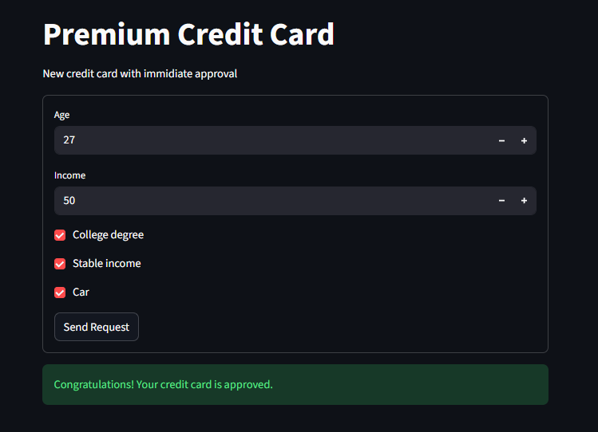

# Scoring service



# Credit Scoring

A small credit scoring project containing data, training code and a minimal inference service.

Main goal is to make predictions on minimal data listed on screenshot.

Repository includes scripts to train a model, a saved model artifact, and a lightweight service to score new examples.

## Quick Start

To copy bad run project follow these instructions

```powershell
git clone 

docker-compose up --build
```

This will:

- build images from `service/Dockerfile` and `app/Dockerfile`
- start the FastAPI service on host port 7000
- start the Streamlit UI on host port 7001

Access the running services in your browser:

- FastAPI Swagger UI: http://localhost:7000/docs
- Streamlit UI: http://localhost:7001

## Training

To retrain the model from `data/scoring.csv` run:

```powershell
python train.py
```

When training completes it should write a model artifact (e.g. `models/best_model.pkl`).


